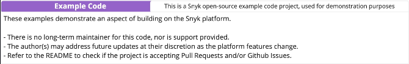

# snyk-deployed-image-coverage

## Why this exists

From a risk perspective, container security teams frequently ask how to prioritize issues for the images actually deployed in production, & distinguish those from the broader set of images that sit in a registry. This repository offers one way to surface that view inside an existing Snyk account: a scheduled reconciliation pattern that discovers workloads in your cluster(s), imports the images that are deployed through your existing registry integrations, tags them for easy filtering, and retires projects when the image is no longer deployed.

On each run it:

1. Discovers clusters in your AWS account (EKS) or Azure subscription(s) (AKS) using the cloud provider SDK (no `kubectl` required).
2. Collects every image reference from running pods (both the `spec.image` tag string and the resolved `sha256` digest from `status.containerStatuses[].image_id`), pairing them per container so each container contributes a single import target.
3. Triggers a Snyk import for each deployed image, every run, routed to the right registry integration by hostname, so vulnerability results for what's running stay current rather than only on first sight.
4. Tags projects `image=deployed` (configurable) after successful imports so you can filter in the Snyk UI.
5. Deletes Snyk projects tagged `image=deployed` whose image is no longer running, then removes the orphaned Snyk target if no projects remain.

## What this is

Reference scripts for Amazon EKS and Azure AKS. The scripts help customers import and identify currently deployed container images using just the Kubernetes API and Snyk's standard registry integrations. Run them on a schedule (for example in CI or a cron job) to keep imports for running images fresh and to maintain a consistent deploy tag (default `image=deployed`) for dashboards, policies, or cleanup.

The approach is the same on both clouds: discover workloads, collect image refs from running pods, pair per container, run Snyk import and tagging, then optionally clean up stale tagged projects. Only cluster discovery and authentication differ per provider; import, tagging, and cleanup logic are shared.

This is one approach among several a customer could adopt to bring deployed-image context into Snyk; teams that already rely on a sensor- or platform-based source of runtime context can continue to use that.

---

## Pick your cloud

| Your environment | Go here |
|--------------------|---------|
| **Azure Kubernetes Service (AKS)** | **[`azure/README.md`](azure/README.md)**: install, env files, how to run `azure/reconcile.py`, flags, and **[technical details](azure/Technical-Details-AKS.md)** |
| **Amazon Elastic Kubernetes Service (EKS)** | **[`aws/README.md`](aws/README.md)**: install, env files, how to run `aws/reconcile.py`, flags, and **[technical details](aws/Technical-Details-EKS.md)** |

Run commands **from the repository root** (for example `.venv/bin/python azure/reconcile.py` or `.venv/bin/python aws/reconcile.py`) so imports resolve.

---

## Quick start (any cloud)

1. Python **3.10+** and a Snyk org with a container registry integration configured for your images.  
2. Create a virtualenv and install deps (full install, or only `azure/` or `aws/` per the README in that folder):

   ```bash
   python3 -m venv .venv
   .venv/bin/pip install -r requirements.txt
   ```

3. Copy the **`.env.example`** files (root + the folder for your cloud) into `.env` / `azure/.env` / `aws/.env` as described in the provider README, then follow that README for auth and first run.

Details, CLI flags (`--dry-run`, `--images-file`, and so on), networking, and troubleshooting stay in the **Azure** and **AWS** READMEs above. This page stays at the overview so you can jump straight to the script that matches your environment.
